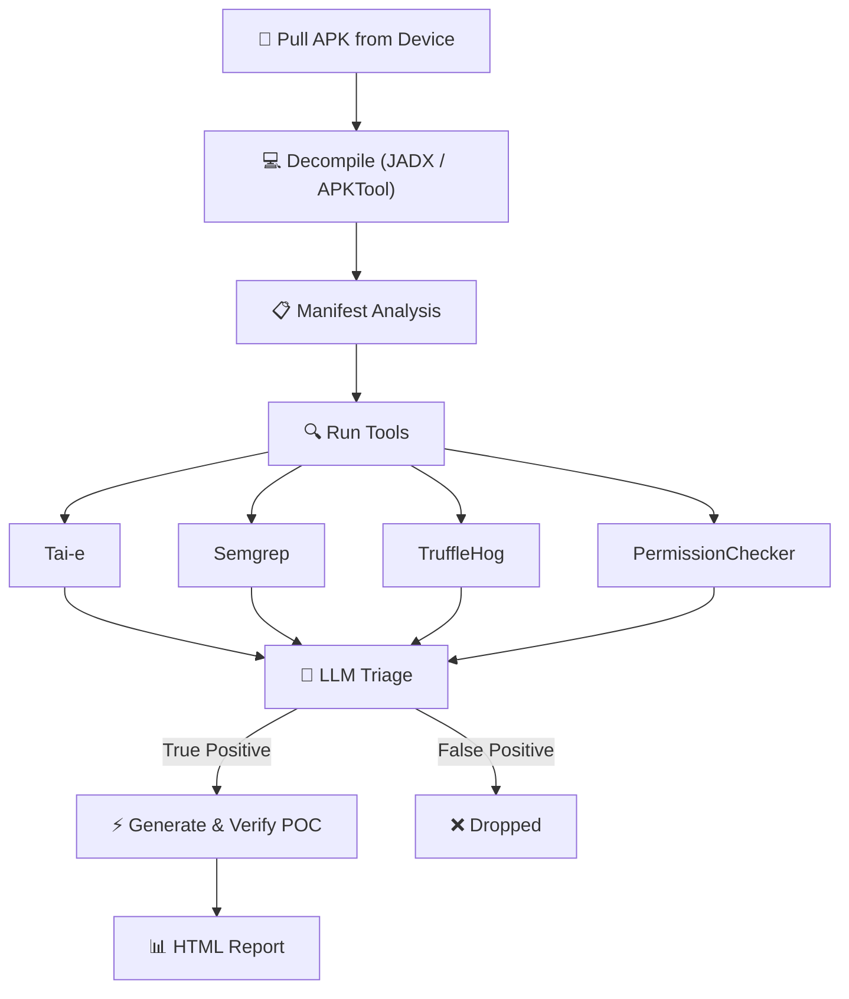

# Thorfinn

<p align="center">
  
</p>

**Automated Android Client-Side Security Scanner**

Thorfinn is an open-source security analysis tool for Android applications built for security engineers, bug bounty hunters who need to identify and exploit client side vulnerabilities in Android applications. It is a plug'n play tool which takes package name of APK installed on device as input and identifies vulnerabilities statically and verifies them using LLM and dynamic analaysis on a real device. It performs taint analysis on given sources and sinks via config rules, pattern matching rules for common misconfigurations, hardcoded secrets and manifest auditing for real permission issues.

## Key Features

- Plug'n play tool, give package name of APK installed on device, and it will do the rest
- Real-time verification of findings using LLM and dynamic analysis on a real device
- Supports Tae-i, SemGrep, TruffleHog, and custom manifest analysis.
- Supports addition of new tools

## Why Thorfinn

Many client side vulnerabilities in Android remain undiscovered because they involve complex cross-class flow and most taint analysis fails to understand android related propogation such as `startActivity()` since this is not a regular method call.
Similarly most manifest auditing tools only check for exported components and some random permission checks, thorfinn identifies real permission issues and misconfigurations in the manifest.
In addition to this it also has the ability to perform pattern matching for common misconfigurations and hardcoded secrets.
It triages every finding using LLM where LLM is fed with real vulnerabilities discovered in various android application and complete context of the flow, generates POCs, executes those on real device and collects the evidence for them if deemed as `TRUE POSTIVE` by LLM. Final report has all the details and with a little manual inspection real vulnerabilities can be discovered and exploited.

## Demo


## Vulnerabilities Identified

- Intent Redirection
- Implicit Intent Interception
- WebView Vulnerability
- Content Provider Path Traversal
- Content Provider Proxy
- Arbitrary File Write
- PendingIntent Redirection
- Changing Device Settings
- Dynamic Receiver Registration
- FileProvider Misconfiguration
- Hardcoded Secrets
- Unprotected Exported Components
- Insecure Application Flags (debuggable, allowBackup, cleartextTraffic)
- Dangerous / Signature-Level Permissions
- Permission Name Typos
- Component Declaration Typos
- Ecosystem Permission Mistakes
- ContentProvider readPermission / writePermission Gaps

## How It Works



## Quick Start

```bash
git clone https://github.com/PhonePe/Thorfinn.git
cd Thorfinn
./setup.sh

# add your LLM key
vim config/config.yml

# plug in a device and go (--config is required)
adb devices
java -jar target/Thorfinn.jar com.target.app --config config/config.yml

# big app? running out of heap space limit time for propogation
java -jar target/Thorfinn.jar com.target.app --config config/config.yml --time-limit 300
```

`setup.sh` handles Java 17, Maven, JADX, Semgrep, TruffleHog, APKTool, ADB, and Python. Works on macOS (Homebrew) and Linux (apt).

## Usage

```
java -jar target/Thorfinn.jar <package-name> --config <path> [options]

Arguments:
  <package-name>              Android package name of the target app (must be installed on connected device)

Options:
  -c, --config <path>         Path to config.yml (required)
  -t, --time-limit <seconds>  Time limit for CPG/taint analysis
  -y, --auto-approve          Auto-approve every LLM-generated POC command without prompting
  -s, --skip-verify           Skip execution of all LLM-generated POC commands
  -h, --help                  Show this help message
```

The `--config` flag is **required** — Thorfinn no longer falls back to a default config location. Pass the path to your `config.yml` (relative paths are resolved against the current working directory).

## POC Verification (LLM-generated commands)

After static analysis and LLM triage, Thorfinn generates a proof-of-concept `adb` command for each finding it deems a **TRUE POSITIVE** and verifies it on the connected device. Because these commands are generated by an LLM and executed against a real device, you control **whether each command runs**:

| Mode | Flag | Behaviour |
|------|------|-----------|
| **Interactive** (default) | *(none)* | Each POC command is shown in a review box and you approve it with `Y` / decline with `N` before it runs. |
| **Auto-approve** | `-y`, `--auto-approve` | Every POC command is executed automatically without prompting. |
| **Skip** | `-s`, `--skip-verify` | No POC commands are executed; findings are reported without dynamic verification. |

In the default interactive mode you'll see a prompt like this for each command, and nothing runs until you respond:

```
╔══════════════════════════════════════════════════════════════════════════════╗
║               LLM-GENERATED POC — REVIEW BEFORE EXECUTION                    ║
╠══════════════════════════════════════════════════════════════════════════════╣
║ Vulnerability : WebView Vulnerability                                        ║
║ Source        : vulnerable.example.app.MainActivity                          ║
║ Sink          : vulnerable.example.app.WebViewActivity                       ║
╠══════════════════════════════════════════════════════════════════════════════╣
║ Command:                                                                     ║
║   adb shell "am start -n vulnerable.example.app/.MainActivity ..."           ║
╚══════════════════════════════════════════════════════════════════════════════╝
[?] Execute this command on device? (Y/N):
```

> ⚠️ Review commands carefully in interactive mode. `--auto-approve` runs every LLM-generated command against your device without review — use it only on test devices/apps you trust.

Examples:

```bash
# Interactive review (default) — approve or skip each command
java -jar target/Thorfinn.jar com.target.app --config config/config.yml

# Run everything unattended
java -jar target/Thorfinn.jar com.target.app --config config/config.yml --auto-approve

# Static findings only, never touch the device with POCs
java -jar target/Thorfinn.jar com.target.app --config config/config.yml --skip-verify
```


## Example Config

Create a `config.yml` and pass it with `-c/--config`. Set `pathConfigs.baseDirectory` to the absolute path of your Thorfinn checkout, and drop your LLM API key in `toolsConfig.llmApiKey`:

```yaml
toolsConfig:
  decompilers: jadx
  analysisTools:
    - taie
    - semgrep
    - permissionChecker
    - truffleHog
  llmApiKey: YOUR_API_KEY
  llmModel: gpt-4
  llmBaseUrl: https://api.openai.com
  taiEAgentEnabled: false                    # flip to true if you reach input token limit in direct flow
  taiEAgentMaxToolResponsePercentage: 30

pathConfigs:
  baseDirectory: REPLACE_BASE_DIRECTORY      # absolute path to your Thorfinn checkout
  decompiledApkPath: /resources/decompiled_apks/
  taiePath: /resources/tools/tai-e-all-0.5.4-SNAPSHOT.jar
  androidPlatformsPath: /resources/android-platforms/
  taieOutputPath: /resources/taie_output/
  taintConfigPath: /config/taint_config.yml
  permissionCheckerPath: /resources/tools/permissionChecker.py
  semgrepRulesPath: /resources/tools/semgrep-rules/
  outputPath: /resources/output/
```

