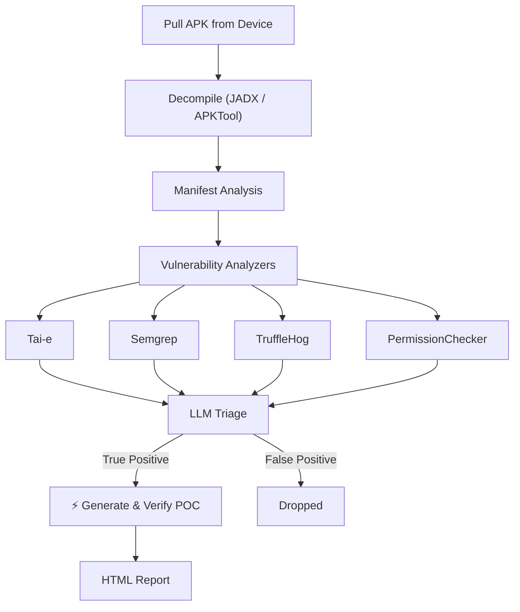

# Thorfinn


<div align="center">

### Drop in an APK. Find client-side vulnerabilities. Validate exploitability with AI.

---

<a href="#quick-start"></a>
&nbsp;
<a href="#demo"></a>
&nbsp;
<a href="#vulnerabilities-identified"></a>
&nbsp;
<a href="#how-it-works"></a>


[](https://discord.com/invite/PrTJ5Hubfm)
&nbsp;
[](https://phonepe.github.io/thorfinn/)

<sub>
  Traces complex Android data flows
  &nbsp;·&nbsp;
  Generates and executes PoCs on a connected device or emulator
  &nbsp;·&nbsp;
  Produces HTML report with evidence
</sub>

</div>

---

Thorfinn is an automated Dynamic Application Security Testing framework for Android apps. Given an Android APK, the framework can identify complex Android client-side vulnerabilities, including WebView hijacking, intent redirection, and more, by decompiling the APK and tracing taint flows between sources and sinks.

Unlike scanners that report isolated risky patterns or rely on generic dynamic payloads, Thorfinn traces attacker-controlled data across classes and Android-specific flows such as intents, extras, deep links, `startActivity()`, and component transitions. It supports configurable sources and sinks, pattern-based checks for common misconfigurations and hardcoded secrets, and Manifest auditing for meaningful permission and component exposure issues.

For all true positive findings, Thorfinn uses the complete taint path and application context to triage the issue, generate targeted proof-of-concept payloads, execute them on the connected device or emulator, and collect runtime evidence. The final report includes the vulnerable flow, affected components, payloads, and validation evidence needed to verify and reproduce real client-side vulnerabilities.

## Demo


## Vulnerabilities Identified

- Intent Redirection
- Implicit Intent Interception
- WebView Vulnerability
- Content Provider Path Traversal
- Content Provider Proxy
- Arbitrary File Write
- PendingIntent Redirection
- Changing Device Settings
- Dynamic Receiver Registration
- FileProvider Misconfiguration
- Hardcoded Secrets
- Unprotected Exported Components
- Insecure Application Flags (debuggable, allowBackup, cleartextTraffic)
- Dangerous / Signature-Level Permissions
- Permission Name Typos
- Component Declaration Typos
- Ecosystem Permission Mistakes
- ContentProvider readPermission / writePermission Gaps

## Quick Start

```bash
git clone https://github.com/PhonePe/Thorfinn.git --recurse-submodules
cd Thorfinn
./setup.sh

# configure your provider and base directory for the project
vim config/config.yml

# plug in a device and go (--config is required)
adb devices
# verify you have device running with target apk installed
java -jar target/Thorfinn.jar com.target.app --config config/config.yml

# big app? running out of heap space limit time for propogation
java -jar target/Thorfinn.jar com.target.app --config config/config.yml --time-limit 300
```

`setup.sh` handles Java 17, Maven, JADX, Semgrep, TruffleHog, APKTool, ADB, Python, and provisioning Android platform 35 into `resources/android-platforms` when `sdkmanager` is available. Works on macOS (Homebrew) and Linux (apt).

### Configuration

After setup, edit `config/config.yml`:

```yaml
toolsConfig:
  decompilers: jadx
  analysisTools:
    - taie
    - semgrep
    - permissionChecker
    - truffleHog
  llmProvider: github-copilot-cli         # github-copilot-cli | openai-compatible
  llmApiKey: ""                          # empty for github-copilot-cli; required for openai-compatible
  llmModel: claude-opus-4.8
  llmBaseUrl: ""                         # openai-compatible only (e.g. https://api.openai.com)
  llmCliCommand: copilot                  # copilot (preferred) or gh
  taiEAgentEnabled: false                 # flip to true if you reach input token limit in direct flow or else keep it false
  taiEAgentMaxToolResponsePercentage: 30 # Max context % for agent tool responses
  taiEMaxHeapGb: 0                        # Specify heap size here, defaults to 75% of available memory if 0
  taiEOnlyApp: true                      # true = taint analysis only app code including everything bundled into it sdk etc. ; false = whole-program including reading their bodies as well
  ignoredPackages:                        # extra packages prefixes to skip during triage/verification, merged with the built-in third-party/SDK list
    - "com.example.thirdparty."
    - "com.yourorg.analytics."

pathConfigs:
  baseDirectory: BASE_DIRECTORY_FOR_THORFINN # Replace this with your base directory path for thorfinn
  decompiledApkPath: /resources/decompiled_apks/
  taiePath: /resources/tools/tai-e-all-0.5.4-SNAPSHOT.jar
  androidPlatformsPath: /resources/android-platforms/
  taieOutputPath: /resources/taie_output/
  taintConfigPath: /config/taint_config.yml
  permissionCheckerPath: /resources/tools/permissionChecker.py
  semgrepRulesPath: /resources/tools/semgrep-rules/
  outputPath: /resources/output/
```

> [!IMPORTANT]
> * `taiEMaxHeapGb` is the maximum heap size for Tai-e analysis. If zero, it will calculate the 75% of available memory and use that as the heap size.
> * `ignoredPackages` is a list of packages that you may want to ignore from verification due to being 3rd party or false positives.
> * `taiEOnlyApp` by default true (strongly recommended for big applications) makes taint analysis only analyze the app code and everything bundled into it (e.g. SDKs). If you want to analyze the whole program including reading their bodies as well, set `taiEOnlyApp` to false in config.yml but this causes issues on larger APKs.
> * `github-copilot-cli` mode requires a working GitHub Copilot CLI installation and login on the machine running Thorfinn. `copilot` is the preferred command; `gh copilot` can also be used through the wrapper.
> * TaiE agent mode uses the OpenAI-compatible provider path only. It does not run with `github-copilot-cli`.
> * For Android 14/15 era apps, keep `resources/android-platforms/android-35/android.jar` present to avoid TaiE API fallback and class-resolution loss.

### Provider Examples

OpenAI-compatible:

```yaml
toolsConfig:
  llmProvider: openai-compatible
  llmApiKey: Bearer YOUR_OPENAI_COMPATIBLE_TOKEN
  llmModel: gpt-4.1-mini
  llmBaseUrl: https://api.openai.com
  taiEAgentEnabled: true
```

GitHub Copilot CLI:

```yaml
toolsConfig:
  llmProvider: github-copilot-cli
  llmModel: gpt-5.4
  llmCliCommand: copilot
  taiEAgentEnabled: false
```

`github-copilot-cli` is suitable for the shared chat analysis path only. If you need TaiE agent mode, use `openai-compatible`.

If you prefer the GitHub CLI wrapper instead of the standalone binary, set `llmCliCommand: gh`. Thorfinn will invoke it as `gh copilot -- ...`.

Copilot CLI setup checklist:

```bash
# 1) command is available on PATH
command -v copilot
# or
command -v gh

# 2) authenticated session exists
copilot auth status
# or
gh auth status

# 3) verify command is callable
copilot --help
# or
gh copilot --help
```

If you use `llmCliCommand: gh`, make sure `gh copilot` works on your machine before running Thorfinn.

Example real scan:

```bash
java -jar target/Thorfinn.jar com.target.app --config config/config.yml --skip-verify
```


## Usage

```
java -jar target/Thorfinn.jar <package-name> --config config/config.yml or <custom path> [options]

Arguments:
  <package-name>              Android package name of the target app (must be installed on connected device)

Options:
  -c, --config <path>         Path to config.yml (required)
  -t, --time-limit <seconds>  Time limit for CPG/taint analysis
  -y, --auto-approve          Auto-approve every LLM-generated POC command without prompting
  -s, --skip-verify           Skip execution of all LLM-generated POC commands
  -h, --help                  Show this help message
```

Thorfinn requires a configuration file for LLM settings, taint rules, tool paths, and verification options. Pass it using the --config flag; relative paths are resolved from the current working directory.

> [!TIP]
> If the target app is large and you run out of heap space during taint analysis, use `--time-limit` to cap propagation time. This can reduce the number of findings, but issues will still be discovered on fully analyzed paths.


## POC Verification (LLM-generated commands)

After static analysis and LLM triage, Thorfinn generates a proof-of-concept using `adb` command for each finding it deems a **TRUE POSITIVE** and verifies it on the connected device. Because these commands are generated by an LLM and executed against a real device, you control **whether each command runs**:

| Mode | Flag | Behaviour |
|------|------|-----------|
| **Interactive** (default) | *(none)* | Each POC command is shown in a review box and you approve it with `Y` / decline with `N` before it runs. |
| **Auto-approve** | `-y`, `--auto-approve` | Every POC command is executed automatically without prompting. |
| **Skip** | `-s`, `--skip-verify` | No POC commands are executed; findings are reported without dynamic verification. |

In the default interactive mode you'll see a prompt like this for each command, and nothing runs until you respond:

```
╔══════════════════════════════════════════════════════════════════════════════╗
║               LLM-GENERATED POC - REVIEW BEFORE EXECUTION                    ║
╠══════════════════════════════════════════════════════════════════════════════╣
║ Vulnerability : WebView Vulnerability                                        ║
║ Source        : vulnerable.example.app.MainActivity                          ║
║ Sink          : vulnerable.example.app.WebViewActivity                       ║
╠══════════════════════════════════════════════════════════════════════════════╣
║ Command:                                                                     ║
║   adb shell "am start -n vulnerable.example.app/.MainActivity ..."           ║
╚══════════════════════════════════════════════════════════════════════════════╝
[?] Execute this command on device? (Y/N):
```

> ⚠️ Review commands carefully in interactive mode. `--auto-approve` runs every LLM-generated command against your device without review - use it only on test devices/apps you trust.

Examples:

```bash
# Interactive review (default) - approve or skip each command
java -jar target/Thorfinn.jar com.target.app --config config/config.yml

# Run everything unattended
java -jar target/Thorfinn.jar com.target.app --config config/config.yml --auto-approve

# Static findings only, never touch the device with POCs
java -jar target/Thorfinn.jar com.target.app --config config/config.yml --skip-verify
```

## API 35 Compatibility Note

If TaiE logs `Android API version '35' not available, using minApkVersion ...`, ensure this file exists:

`resources/android-platforms/android-35/android.jar`

`setup.sh` now provisions Android platform 35 through `sdkmanager` into `.android-sdk` and copies `android.jar` into `resources/android-platforms/android-35/`.


## How It Works



## Final Report

For validated findings, Thorfinn reports:

- Vulnerability type and severity
- Source and sink details
- Complete taint path
- Affected Android components
- Relevant Manifest configuration
- Generated proof-of-concept payload
- Device or emulator execution output
- Runtime evidence of exploitability
- Context required to manually reproduce and validate the issue

## Documentation

Read the detailed documentation for installation, configuration, rule customization, supported checks, and architecture:

**[phonepe.github.io/thorfinn](https://phonepe.github.io/thorfinn/)**

## Tools Credits

- [Tai-e](https://github.com/pascal-lab/Tai-e)
- [Semgrep](https://github.com/semgrep/semgrep)
- [TruffleHog](https://github.com/trufflesecurity/trufflehog)

## Responsible Use

Thorfinn is intended for authorized security testing, research, and bug bounty programs where you have permission to assess the target application.

Do not use Thorfinn against applications, devices, or environments without explicit authorization.

## License

Thorfinn is licensed under the [Apache License 2.0](LICENSE).