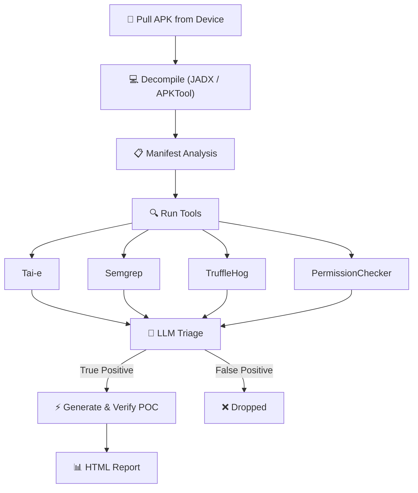

# Thorfinn

<p align="center">
  
</p>

**Automated Android Client-Side Security Scanner**

Thorfinn is an open-source security analysis tool for Android applications built for security engineers who need to identify exploitable client-side vulnerabilities. It performs cross-class taint analysis on decompiled APKs, runs pattern matching rules for misconfigurations, scans for hardcoded secrets, and audits the manifest for export issues — then verifies findings on a real device.

## Why Thorfinn

Many exploitable Android issues are not visible inside a single class. Intent data may enter through an exported Activity, pass through routers, services, and utility classes, and only become dangerous when it reaches a sink such as `startActivity()`, `WebView.loadUrl()`, `ContentResolver.openInputStream()`, or `sendBroadcast()` in a completely different class. Other issues — dynamically registered receivers with custom actions, overly broad FileProvider grants, hardcoded API keys, exported components without permission protection — require different detection techniques entirely.

Thorfinn is built for that review problem. It combines taint analysis, pattern matching, secret scanning, and manifest auditing into a single pipeline, uses an LLM to determine whether each finding is actually exploitable, and proves it by generating and executing a proof-of-concept on the device.

## How It Works



## Quick Start

```bash
git clone https://github.com/PhonePe/Thorfinn.git
cd Thorfinn
./setup.sh

# add your LLM key
vim config/config.yml

# plug in a device and go
adb devices
java -jar target/Thorfinn.jar com.target.app

# big app? give the taint engine more time
java -jar target/Thorfinn.jar com.target.app --time-limit 600
```

`setup.sh` handles Java 17, Maven, JADX, Semgrep, TruffleHog, APKTool, ADB, and Python. Works on macOS (Homebrew) and Linux (apt).

## LLM Setup

Drop your API key in `config/config.yml`:

```yaml
toolsConfig:
  llmApiKey: YOUR_API_KEY
  llmModel: gpt-4
  llmBaseUrl: https://api.openai.com/v1
  taiEAgentEnabled: false    # flip to true if you want the LLM to explore the codebase on its own
```

## Docs

Architecture, taint config, custom rules, adding new tools — it's all in .

## License

[MIT](LICENSE)

## Contributors

<p align="center">
  <a href="https://github.com/PhonePe/Thorfinn/graphs/contributors">
    
  </a>
</p>
