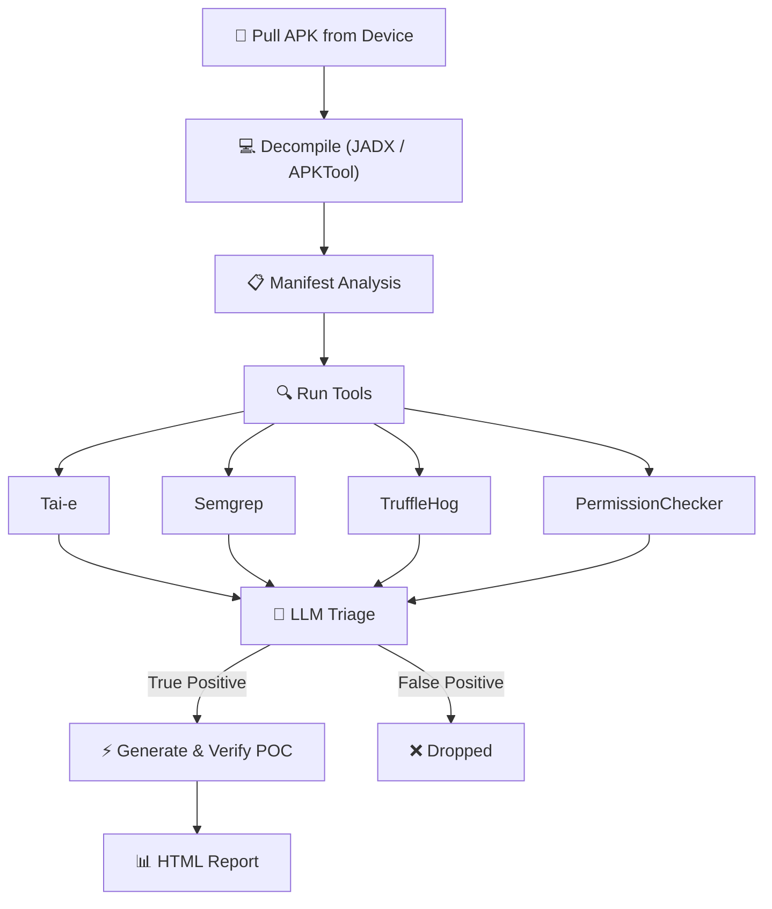

# Thorfinn

<p align="center">
  
</p>

**Automated Android Client-Side Security Scanner**

Thorfinn is an open-source security analysis tool for Android applications built for security engineers, bug bounty hunters who need to identify and exploit client side vulnerabilities in Android applications. It is a plug'n play tool which takes package name of APK installed on device as input and identifies vulnerabilities statically and verifies them using LLM and dynamic analaysis on a real device. It performs taint analysis on given sources and sinks via config rules, pattern matching rules for common misconfigurations, hardcoded secrets and manifest auditing for real permission issues.

## Key Features

- Plug'n play tool, give package name of APK installed on device, and it will do the rest
- Real-time verification of findings using LLM and dynamic analysis on a real device
- Supports Tae-i, SemGrep, TruffleHog, and custom manifest analysis.
- Supports addition of new tools

## Why Thorfinn

Many client side vulnerabilities in Android remain undiscovered because they involve complex cross-class flow and most taint analysis fails to understand android related propogation such as `startActivity()` since this is not a regular method call. 
Similarly most manifest auditing tools only check for exported components and some random permission checks, thorfinn identifies real permission issues and misconfigurations in the manifest.
In addition to this it also has the ability to perform pattern matching for common misconfigurations and hardcoded secrets.
It triages every finding using LLM where LLM is fed with real vulnerabilities discovered in various android application and complete context of the flow, generates POCs, executes those on real device and collects the evidence for them if deemed as `TRUE POSTIVE` by LLM. Final report has all the details and with a little manual inspection real vulnerabilities can be discovered and exploited.

## Demo


## Vulnerabilities Identified

- Intent Redirection
- Implicit Intent Interception
- WebView Vulnerability
- Content Provider Path Traversal
- Content Provider Proxy
- Arbitrary File Write
- PendingIntent Redirection
- Changing Device Settings
- Dynamic Receiver Registration
- FileProvider Misconfiguration
- Hardcoded Secrets
- Unprotected Exported Components
- Insecure Application Flags (debuggable, allowBackup, cleartextTraffic)
- Dangerous / Signature-Level Permissions
- Permission Name Typos
- Component Declaration Typos
- Ecosystem Permission Mistakes
- ContentProvider readPermission / writePermission Gaps

## How It Works



## Quick Start

```bash
git clone https://github.com/PhonePe/Thorfinn.git
cd Thorfinn
./setup.sh

# add your LLM key
vim config/config.yml

# plug in a device and go
adb devices
java -jar target/Thorfinn.jar com.target.app

# big app? running out of heap space limit time for propogation
java -jar target/Thorfinn.jar com.target.app --time-limit 300
```

`setup.sh` handles Java 17, Maven, JADX, Semgrep, TruffleHog, APKTool, ADB, and Python. Works on macOS (Homebrew) and Linux (apt).

## LLM Setup

Drop your API key in `config/config.yml`:

```yaml
toolsConfig:
  llmApiKey: YOUR_API_KEY
  llmModel: gpt-4
  llmBaseUrl: https://api.openai.com/v1
  taiEAgentEnabled: false    # flip to true if you reach input token limit in direct flow or else keep it false
```

## Docs

Architecture, taint config, custom rules, adding new tools — it's all in .

## License

[MIT](LICENSE)

## Contributors

<p align="center">
  <a href="https://github.com/PhonePe/Thorfinn/graphs/contributors">
    
  </a>
</p>
