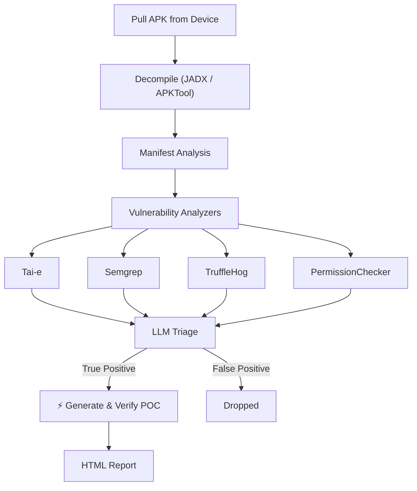

# Thorfinn


<div align="center">

### Drop in an APK. Find client-side vulnerabilities. Validate exploitability with AI.

---

<a href="#quick-start"></a>
&nbsp;
<a href="#demo"></a>
&nbsp;
<a href="#vulnerabilities-identified"></a>
&nbsp;
<a href="#how-it-works"></a>


[](https://discord.com/invite/PrTJ5Hubfm)
&nbsp;
[](https://phonepe.github.io/thorfinn/)

<sub>
  Traces complex Android data flows
  &nbsp;·&nbsp;
  Generates and executes PoCs on a connected device or emulator
  &nbsp;·&nbsp;
  Produces HTML report with evidence
</sub>

</div>

---

Thorfinn is an automated Dynamic Application Security Testing framework for Android apps. Given an Android APK, the framework can identify complex Android client-side vulnerabilities, including WebView hijacking, intent redirection, and more, by decompiling the APK and tracing taint flows between sources and sinks.

Unlike scanners that report isolated risky patterns or rely on generic dynamic payloads, Thorfinn traces attacker-controlled data across classes and Android-specific flows such as intents, extras, deep links, `startActivity()`, and component transitions. It supports configurable sources and sinks, pattern-based checks for common misconfigurations and hardcoded secrets, and Manifest auditing for meaningful permission and component exposure issues.

For all true positive findings, Thorfinn uses the complete taint path and application context to triage the issue, generate targeted proof-of-concept payloads, execute them on the connected device or emulator, and collect runtime evidence. The final report includes the vulnerable flow, affected components, payloads, and validation evidence needed to verify and reproduce real client-side vulnerabilities.

## Demo


## Vulnerabilities Identified

- Intent Redirection
- Implicit Intent Interception
- WebView Vulnerability
- Content Provider Path Traversal
- Content Provider Proxy
- Arbitrary File Write
- PendingIntent Redirection
- Changing Device Settings
- Dynamic Receiver Registration
- FileProvider Misconfiguration
- Hardcoded Secrets
- Unprotected Exported Components
- Insecure Application Flags (debuggable, allowBackup, cleartextTraffic)
- Dangerous / Signature-Level Permissions
- Permission Name Typos
- Component Declaration Typos
- Ecosystem Permission Mistakes
- ContentProvider readPermission / writePermission Gaps

## Quick Start

```bash
git clone https://github.com/PhonePe/Thorfinn.git --recurse-submodules
cd Thorfinn
./setup.sh

# add your LLM key
vim config/config.yml

# plug in a device and go (--config is required)
adb devices
java -jar target/Thorfinn.jar com.target.app --config config/config.yml

# big app? running out of heap space limit time for propogation
java -jar target/Thorfinn.jar com.target.app --config config/config.yml --time-limit 300
```

`setup.sh` handles Java 17, Maven, JADX, Semgrep, TruffleHog, APKTool, ADB, and Python. Works on macOS (Homebrew) and Linux (apt).

### Configuration

After setup, edit the config at `config/config.yml`:

```yaml
toolsConfig:
  decompilers: jadx
  analysisTools:
    - taie
    - semgrep
    - permissionChecker
    - truffleHog
  llmApiKey: YOUR_API_KEY
  llmModel: gpt-4
  llmBaseUrl: https://api.openai.com/v1
  taiEAgentEnabled: false                 # flip to true if you reach input token limit in direct flow or else keep it false
  taiEAgentMaxToolResponsePercentage: 30 # Max context % for agent tool responses

pathConfigs:
  baseDirectory: BASE_DIRECTORY_FOR_PROJECT
  decompiledApkPath: /resources/decompiled_apks/
  taiePath: /resources/tools/tai-e-all-0.5.4-SNAPSHOT.jar
  androidPlatformsPath: /resources/android-platforms/
  taieOutputPath: /resources/taie_output/
  taintConfigPath: /config/taint_config.yml
  permissionCheckerPath: /resources/tools/permissionChecker.py
  semgrepRulesPath: /resources/tools/semgrep-rules/
  outputPath: /resources/output/
```

## Usage

```
java -jar target/Thorfinn.jar <package-name> --config config/config.yml or <custom path> [options]

Arguments:
  <package-name>              Android package name of the target app (must be installed on connected device)

Options:
  -c, --config <path>         Path to config.yml (required)
  -t, --time-limit <seconds>  Time limit for CPG/taint analysis
  -y, --auto-approve          Auto-approve every LLM-generated POC command without prompting
  -s, --skip-verify           Skip execution of all LLM-generated POC commands
  -h, --help                  Show this help message
```

Thorfinn requires a configuration file for LLM settings, taint rules, tool paths, and verification options. Pass it using the --config flag; relative paths are resolved from the current working directory.

> [!TIP]
> If the target app is large, and you run out of heap space during taint analysis, use the `--time-limit` option to limit the time spent on propagation. This will reduce the number of findings as application propogation is cut short, but issues will be discovered on the paths that have been fully analyzed.


## POC Verification (LLM-generated commands)

After static analysis and LLM triage, Thorfinn generates a proof-of-concept using `adb` command for each finding it deems a **TRUE POSITIVE** and verifies it on the connected device. Because these commands are generated by an LLM and executed against a real device, you control **whether each command runs**:

| Mode | Flag | Behaviour |
|------|------|-----------|
| **Interactive** (default) | *(none)* | Each POC command is shown in a review box and you approve it with `Y` / decline with `N` before it runs. |
| **Auto-approve** | `-y`, `--auto-approve` | Every POC command is executed automatically without prompting. |
| **Skip** | `-s`, `--skip-verify` | No POC commands are executed; findings are reported without dynamic verification. |

In the default interactive mode you'll see a prompt like this for each command, and nothing runs until you respond:

```
╔══════════════════════════════════════════════════════════════════════════════╗
║               LLM-GENERATED POC - REVIEW BEFORE EXECUTION                    ║
╠══════════════════════════════════════════════════════════════════════════════╣
║ Vulnerability : WebView Vulnerability                                        ║
║ Source        : vulnerable.example.app.MainActivity                          ║
║ Sink          : vulnerable.example.app.WebViewActivity                       ║
╠══════════════════════════════════════════════════════════════════════════════╣
║ Command:                                                                     ║
║   adb shell "am start -n vulnerable.example.app/.MainActivity ..."           ║
╚══════════════════════════════════════════════════════════════════════════════╝
[?] Execute this command on device? (Y/N):
```

> ⚠️ Review commands carefully in interactive mode. `--auto-approve` runs every LLM-generated command against your device without review - use it only on test devices/apps you trust.

Examples:

```bash
# Interactive review (default) - approve or skip each command
java -jar target/Thorfinn.jar com.target.app --config config/config.yml

# Run everything unattended
java -jar target/Thorfinn.jar com.target.app --config config/config.yml --auto-approve

# Static findings only, never touch the device with POCs
java -jar target/Thorfinn.jar com.target.app --config config/config.yml --skip-verify
```


## How It Works



## Final Report

For validated findings, Thorfinn reports:

- Vulnerability type and severity
- Source and sink details
- Complete taint path
- Affected Android components
- Relevant Manifest configuration
- Generated proof-of-concept payload
- Device or emulator execution output
- Runtime evidence of exploitability
- Context required to manually reproduce and validate the issue

## Documentation

Read the detailed documentation for installation, configuration, rule customization, supported checks, and architecture:

**[phonepe.github.io/thorfinn](https://phonepe.github.io/thorfinn/)**

## Tools Credits

- [Tai-e](https://github.com/pascal-lab/Tai-e)
- [Semgrep](https://github.com/semgrep/semgrep)
- [TruffleHog](https://github.com/trufflesecurity/trufflehog)

## Responsible Use

Thorfinn is intended for authorized security testing, research, and bug bounty programs where you have permission to assess the target application.

Do not use Thorfinn against applications, devices, or environments without explicit authorization.

## License

Thorfinn is licensed under the [Apache License 2.0](LICENSE).