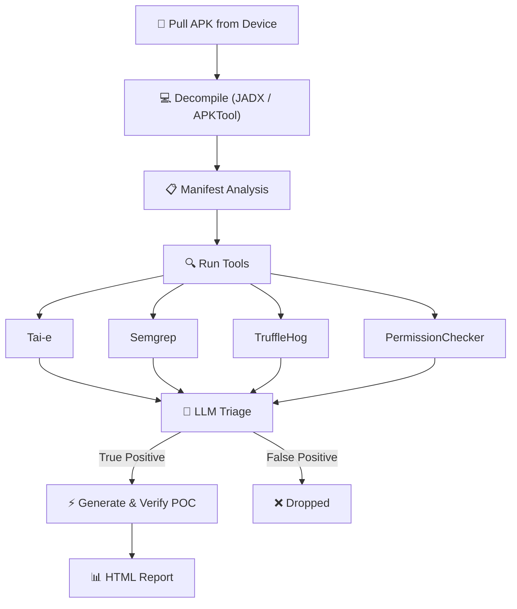

# Thorfinn

<p align="center">
  
</p>

<div align="center">

### Drop in an APK. Find client-side vulnerabilities. Validate exploits with AI.

<br/>

[](LICENSE)
[](https://github.com/PhonePe/thorfinn/stargazers)


<br/>

[](https://discord.com/invite/PrTJ5Hubfm)
&nbsp;
[](https://phonepe.github.io/thorfinn/)

<br/>

**[Quick Start](#quick-start)** · **[Why Thorfinn](#why-thorfinn)** · **[Vulnerabilities Identified](#Vulnerabilities-Identified)** · **[How It Works](#how-it-works)** · **[Docs](https://phonepe.github.io/thorfinn/)**

<br/>

</div>

Thorfinn is an open-source Android APK security analysis tool for security engineers and bug bounty hunters. Provide the package name of an app installed on a connected device or emulator, and Thorfinn analyzes it for client-side vulnerabilities, then validates high-confidence findings through LLM-assisted dynamic testing.

Unlike scanners that report isolated risky patterns or rely on generic dynamic payloads, Thorfinn traces attacker-controlled data across classes and Android-specific flows such as intents, extras, deep links, `startActivity()`, and component transitions. It supports configurable sources and sinks, pattern-based checks for common misconfigurations and hardcoded secrets, and Manifest auditing for meaningful permission and component exposure issues.

For high-confidence findings, Thorfinn uses the complete taint path and application context to triage the issue, generate targeted proof-of-concept payloads, execute them on the connected device or emulator, and collect runtime evidence. The final report includes the vulnerable flow, affected components, payloads, and validation evidence needed to verify and reproduce real client-side vulnerabilities.

## Demo


## Vulnerabilities Identified

- Intent Redirection
- Implicit Intent Interception
- WebView Vulnerability
- Content Provider Path Traversal
- Content Provider Proxy
- Arbitrary File Write
- PendingIntent Redirection
- Changing Device Settings
- Dynamic Receiver Registration
- FileProvider Misconfiguration
- Hardcoded Secrets
- Unprotected Exported Components
- Insecure Application Flags (debuggable, allowBackup, cleartextTraffic)
- Dangerous / Signature-Level Permissions
- Permission Name Typos
- Component Declaration Typos
- Ecosystem Permission Mistakes
- ContentProvider readPermission / writePermission Gaps

## Quick Start

```bash
git clone https://github.com/PhonePe/Thorfinn.git --recurse-submodules
cd Thorfinn
./setup.sh

# add your LLM key
vim config/config.yml

# plug in a device and go (--config is required)
adb devices
java -jar target/Thorfinn.jar com.target.app --config config/config.yml

# big app? running out of heap space limit time for propogation
java -jar target/Thorfinn.jar com.target.app --config config/config.yml --time-limit 300
```

`setup.sh` handles Java 17, Maven, JADX, Semgrep, TruffleHog, APKTool, ADB, and Python. Works on macOS (Homebrew) and Linux (apt).

## Usage

```
java -jar target/Thorfinn.jar <package-name> --config <path> [options]

Arguments:
  <package-name>              Android package name of the target app (must be installed on connected device)

Options:
  -c, --config <path>         Path to config.yml (required)
  -t, --time-limit <seconds>  Time limit for CPG/taint analysis
  -y, --auto-approve          Auto-approve every LLM-generated POC command without prompting
  -s, --skip-verify           Skip execution of all LLM-generated POC commands
  -h, --help                  Show this help message
```

The `--config` flag is **required** — Thorfinn no longer falls back to a default config location. Pass the path to your `config.yml` (relative paths are resolved against the current working directory).

## POC Verification (LLM-generated commands)

After static analysis and LLM triage, Thorfinn generates a proof-of-concept `adb` command for each finding it deems a **TRUE POSITIVE** and verifies it on the connected device. Because these commands are generated by an LLM and executed against a real device, you control **whether each command runs**:

| Mode | Flag | Behaviour |
|------|------|-----------|
| **Interactive** (default) | *(none)* | Each POC command is shown in a review box and you approve it with `Y` / decline with `N` before it runs. |
| **Auto-approve** | `-y`, `--auto-approve` | Every POC command is executed automatically without prompting. |
| **Skip** | `-s`, `--skip-verify` | No POC commands are executed; findings are reported without dynamic verification. |

In the default interactive mode you'll see a prompt like this for each command, and nothing runs until you respond:

```
╔══════════════════════════════════════════════════════════════════════════════╗
║               LLM-GENERATED POC — REVIEW BEFORE EXECUTION                    ║
╠══════════════════════════════════════════════════════════════════════════════╣
║ Vulnerability : WebView Vulnerability                                        ║
║ Source        : vulnerable.example.app.MainActivity                          ║
║ Sink          : vulnerable.example.app.WebViewActivity                       ║
╠══════════════════════════════════════════════════════════════════════════════╣
║ Command:                                                                     ║
║   adb shell "am start -n vulnerable.example.app/.MainActivity ..."           ║
╚══════════════════════════════════════════════════════════════════════════════╝
[?] Execute this command on device? (Y/N):
```

> ⚠️ Review commands carefully in interactive mode. `--auto-approve` runs every LLM-generated command against your device without review — use it only on test devices/apps you trust.

Examples:

```bash
# Interactive review (default) — approve or skip each command
java -jar target/Thorfinn.jar com.target.app --config config/config.yml

# Run everything unattended
java -jar target/Thorfinn.jar com.target.app --config config/config.yml --auto-approve

# Static findings only, never touch the device with POCs
java -jar target/Thorfinn.jar com.target.app --config config/config.yml --skip-verify
```


## How It Works



### Documentation

To know more about Thorfinn and it's features, you can read our detailed documentation [here](https://phonepe.github.io/thorfinn/index.html).