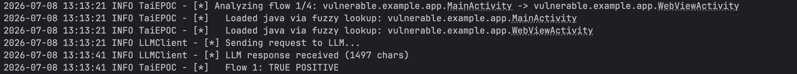

# Features

## Vulnerability Detection

Thorfinn analyzes the decompiled app to find how attacker-controlled input like Intent extras, deep link URIs, Content Provider parameters reaches security-sensitive operations, and flags insecure API usage, misconfigurations, hardcoded secrets, and manifest weaknesses along the way.

### Example: Webview Hijacking

WebView Hijacking is a common client-side vulnerability in Android apps. It occurs when an attacker can control the URL loaded into a WebView. Following is an example vulnerable Webview Hijacking code.

#### DeeplinkHandlerActivity.java

```java
    protected void onCreate(Bundle savedInstanceState) {
        super.onCreate(savedInstanceState);
        EdgeToEdge.enable(this);
        setContentView(R.layout.activity_main);
        Uri uri;
        Intent intent = getIntent();
        if (intent != null && "android.intent.action.VIEW".equals(intent.getAction()) && (uri = intent.getData()) != null) {
            processDeeplink(uri);
        }
    }
    private void processDeeplink(Uri uri) {
        String url;
        String host;
        if ("custom".equals(uri.getScheme()) && "deeplink".equals(uri.getHost())) {
            String path = uri.getPath();
            if ("/webview".equals(path) && (url = uri.getQueryParameter("url")) != null && (host = Uri.parse(url).getHost()) != null) {
                Intent i2 = new Intent(this, (Class<?>) WebViewActivity.class);
                i2.putExtra("url", url);
                startActivity(i2);
            }
        }
    }
```

#### WebViewActivity.java

```java
    public class WebViewActivity extends AppCompatActivity {
    
        @Override
        protected void onCreate(Bundle savedInstanceState) {
            super.onCreate(savedInstanceState);
            EdgeToEdge.enable(this);
            setContentView(R.layout.activity_webview);
            WebView webView = (WebView) findViewById(R.id.myWebView);
            setupWebView(webView);
            webView.loadUrl(getIntent().getStringExtra("url"));
        }
    
        private void setupWebView(WebView webView) {
            webView.setWebChromeClient(new WebChromeClient());
            webView.setWebViewClient(new WebViewClient());
            webView.getSettings().setJavaScriptEnabled(true);
            webView.getSettings().setAllowFileAccessFromFileURLs(true);
        }
    
    }
```

`WebViewActivity.java` is not exported, so loading a URL into the dangerous sink `WebView.loadUrl()` looks unreachable on its own. But `DeeplinkHandlerActivity.java` takes the `uri` from an incoming Intent, pulls the `url` query parameter out of it, puts that value into an Intent extra, and forwards it to `WebViewActivity.java` via `startActivity()`. Thorfinn recognizes that the attacker-controlled URL still reaches the WebView through this chain and reports the complete, exploitable flow that single-component scanners miss.

## LLM Triage

Each candidate finding is reviewed with its full vulnerability context, including the taint flow, decompiled source code for the involved classes, and the complete `AndroidManifest.xml`.

The LLM-assisted triage checks component exposure, validation logic, sanitization, and known Android vulnerability patterns to classify the finding as a likely true positive or false positive. This helps reduce noise so you can focus on findings that are more likely to be exploitable.


<div align="center">
  
</div>


## POC Execution & Evidence Collection

For findings classified as likely true positives, Thorfinn generates a concrete proof of concept. This can be an `adb shell` command for direct execution or attacker-app source code for cases that require a separate malicious application, such as PendingIntent redirection.

Each PoC is then executed on the connected device or emulator through ADB. Thorfinn captures evidence such as logcat output and network traffic, and records the result as confirmed, failed, or requiring manual verification.

The final report includes the verdict, vulnerability class, analysis summary, PoC command, execution output, and collected evidence for each finding.

