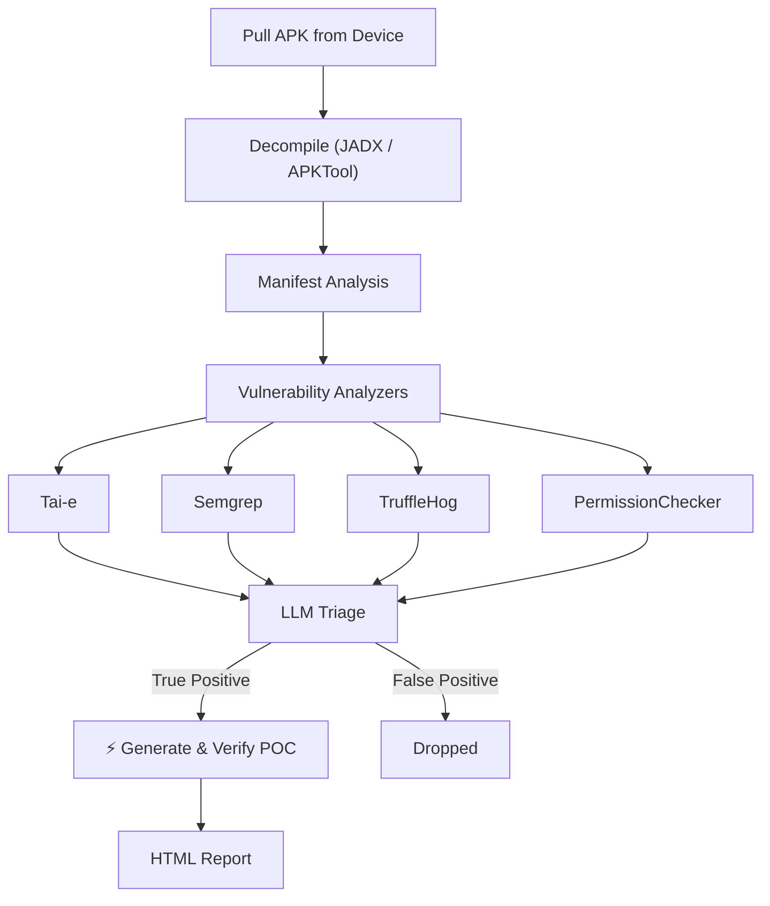

  

Thorfinn is an automated Dynamic Application Security Testing framework for Android apps. Given an Android APK, the framework can identify complex Android client-side vulnerabilities, including WebView hijacking, intent redirection, and more, by reversing the APK and tracing taint flows between researched sources and sinks.

Thorfinn then generates an exploit payload and dynamically executes it on a connected device or emulator.

### Who is this for?

* **Penetration Testers and Bug Bounty Hunters** analyzing Android applications to identify, validate, and reproduce client-side vulnerabilities.
* **Mobile Product Security Teams** looking to automate the identification of client-side security vulnerabilities during Android application releases.

### Skip the Docs, Get Running Fast

If you want to quickly get started with Thorfinn, follow the [Installation Guide](./installation-guide.md).

### How Thorfinn works ?

1. **Pull APK** - Thorfinn resolves the package name on the connected device or emulator and pulls the target APK.

2. **Decompile APK** - Decompiles the APK using the configured decompiler, such as JADX or APKTool.

3. **Manifest Analysis** - Parses `AndroidManifest.xml` to extract the package name, SDK versions, exported components (Activities, Services, Receivers, Providers), their permissions, intent filters, and security flags (`debuggable`, `allowBackup`, `usesCleartextTraffic`).

4. **Run Analysis**
    - Loads taint analysis rules from configuration. These rules describe the Android entry points, security-sensitive operations, and propagation patterns required for each vulnerability type.

    - Identifies attacker-controlled inputs such as **intents, extras, deep links, URI parameters, ContentProvider inputs**, and externally accessible components.

    - Identifies security-sensitive operations such as **component launches, WebViews, file operations, ContentProvider access, PendingIntents, permissions**, and device-setting changes.

    - The **taint engine** traces whether attacker-controlled data can reach these sinks across classes and Android-specific flows such as `startActivity()`, intents, extras, activities, services, broadcast receivers, and ContentProviders.

    - In addition to this, it performs **Manifest auditing** to identify permission issues, exported component risks, insecure application flags, FileProvider misconfigurations, and ContentProvider permission gaps.

    - Runs **pattern-based checks** to detect common Android misconfigurations, insecure implementation patterns, and hardcoded secrets.

5. **LLM Triage** - Each finding is reviewed with the full vulnerability context, including the raw taint flow, decompiled source code for involved classes, relevant AndroidManifest details, and known Android vulnerability patterns to determine whether it is likely exploitable or a false positive.

6. **Generate PoCs** - For all true positives, Thorfinn generates a concrete proof of concept, such as an `adb shell` command for direct execution or attacker-app source code for cases that require a separate malicious application, such as PendingIntent redirection.

7. **Verify on Device** - Executes each approved PoC on the connected device or emulator through ADB, captures evidence such as logcat output and network traffic, and records the result as confirmed, failed, or requiring manual verification.

8. **HTML Report** - Produces a final HTML report with each finding, its verdict, vulnerability class, analysis summary, PoC command, execution output, and collected evidence.

### What vulnerabilities does it cover?

| Issue                              | Description |
|------------------------------------|---|
| `Intent Redirection`               | Identifies flows where attacker-controlled Intent data can redirect an application into launching unintended internal or external components. |
| `Implicit Intent Interception`     | Identifies implicit Intent usage that may allow another application to intercept sensitive data or actions. |
| `Pending Intent Redirection`       | Identifies unsafe PendingIntent handling that may allow an attacker to modify or redirect the final Intent target. |
| `Webview Vulnerability`            | Identifies insecure WebView configurations and flows that may expose JavaScript interfaces, unsafe URL loading, or local file access risks. |
| `Content Provider Path Traversal`  | Identifies attacker-controlled paths that can reach ContentProvider file access or traversal-sensitive operations. |
| `Content Provider Proxy`           | Identifies ContentProviders that can be abused as proxies to access restricted components, files, or privileged operations. |
| `Arbitrary File Write`             | Identifies flows where attacker-controlled input can influence file paths or file-writing operations. |
| `Fileprovider Misconfiguration`    | Identifies insecure FileProvider configuration, exposed paths, and unsafe URI-sharing behavior. |
| `Dynamic Receiver Registration`    | Identifies dynamically registered receivers that may expose sensitive functionality or accept untrusted broadcasts. |
| `Changing Device Settings`         | Identifies application flows that may allow attacker-controlled input to modify device settings or security-sensitive preferences. |
| `Unprotected Exported Components`  | Identifies exported activities, services, receivers, and providers that expose sensitive functionality without adequate protection. |
| `Insecure Application Flags`       | Identifies risky application settings such as `debuggable`, `allowBackup`, and `usesCleartextTraffic`. |
| `Dangerous Permissions`            | Identifies dangerous, signature-level, incorrectly declared, or incorrectly enforced permissions. |
| `Permission Name Typos`            | Identifies permission declaration mistakes that can silently weaken intended access control. |
| `Component Declaration Typos`      | Identifies Manifest component declaration errors that may expose or disable security controls unexpectedly. |
| `Ecosystem Permission Mistakes`    | Identifies Android ecosystem permission misuse and assumptions that do not provide the intended protection. |
| `Content Provider Permission Gaps` | Identifies missing or inconsistent `readPermission`, `writePermission`, and exported-provider access controls. |
| `Hardcoded Secrets`                | Identifies embedded credentials, API keys, tokens, and other sensitive values packaged in the application. |